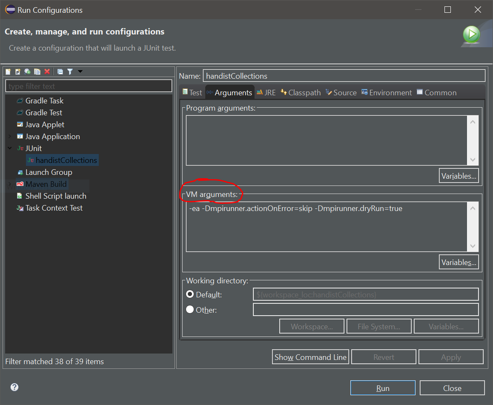

# Configuring the MpiRunner

There are a number of settings you can use to fit your particular needs. These options can be set by defining them in the command line with `-Dmpirunner.<option>=value`.

## Options available

The list of all options available are present in file [Configuration.java](https://github.com/handist/mpi-junit/blob/master/src/main/java/handist/mpijunit/Configuration.java). You can [refer to the Javadoc]() to read about specific options. This page provides real use scenarios for most options available

## Configuration examples

### Configuration for a local machine that cannot run Mpi tests

When developing complex libraries, you may have "normal" Junit tests for some features and some tests for distributed feature that use the MpiRunner. You may not have the software on the machine you use everyday to run those distributed tests. As a result, the tests that need the MpiRunner will show errors.

To avoid having the tests that use the MpiRunner show as "Error" you can define the option `mpirunner.actionOnError=skip`. When the MpiRunner encounters an error that prevents him from launching the tests or parsing the results, it will not show every test method for every rank as "skipped".

Moreover, if you have a test server capable of running the tests, you can choose to keep the notification files of the tests that run on that test server, download them on your personal machine and have the MpiRunner parse them directly without trying to launch the tests.

To do this, you will need to activate option `mpirunner.keepNotifications=true` on your test server. Using this option, the test server will not delete the files produced by each rank containing the test results.

Then, on your personal machine, you will want to activate option `mpirunner.dryRun=true`. This will result in the MpiLauncher not launching any MPI command and directly skip to the test-parsing phase. By downloading the notification files from the server on your local machine, the results of the server will be shown as if they the tests had run on your personal machine.

### Running and parsing tests from a single host

In the default Launcher implementation, all the ranks run the tests of the test class. It is possible that this does not correspond to your needs. For instance, you may have some additional distributed computation library (APGAS for Java for instance) that allows you to control remote processes from a thread in a particular rank (presumably rank 0?).

In this situation you will want to [use a custom Launcher](https://handist.github.io/mpi-junit/HowItWorks.html#implementing-a-custom-launcher) for your test class that only launches the tests on rank 0. As a result, a single notification file will be produced.

By default, the MpiRunner looks for notification files for each rank. In the absence of any file from any rank, errors are thrown.

To avoid this, you will want to activate option `mpirunner.parseNotification=<rank>` with `<rank>` taking the value of the only rank that actually produces test results. With this option, the MpiRunner will only look for the the notification file of this specific rank, ignoring any other.

This option could also be used if you have many tests and want to look at the results of a single one rather than all of them together. In this case you may want to run the tests once with the `mpirunner.keepNotifications=true` option activated and then activate `mpirunner.parseNotification=<rank>` along with `mpirunner.dryRun=true` to avoid relaunching the tests every time you want to look at the results from a different rank. 

## Where to make the configuration ?

### With the Eclipse IDE

The options can be defined in the JVM options in the `RunConfigurations` page by adding `-Doption=value` into the VM arguments section.



### With the Maven surefire and failsafe plugins

When running your tests with either plugin, you can define the settings of the MpiRunner for your particular needs in the `systemPropertyVariables` in your `pom.xml`.

**Important**: When using the MpiRunner with the *maven-surefire-plugin* of the *maven-failsae-plugin*, you should use version 3.0.0-M5 (or later) AND set this option in your configuration: `<forkNode implementation="org.apache.maven.plugin.surefire.extensions.SurefireForkNodeFactory" />`. If you don't, any output your test program makes to stdout or stderr will not be displayed in the console output. A "Corrupted STDOUT by directly writing to native stream in forked JVM" error message will be displayed instead. In practice this does not prevent the tests from running, but it's not as practical.

Below is a configuration example for the `maven-surefire-plugin` using the "native" mpi implementation. Notice that in this example, the path to the shared-object libraries is defined using an environment variable which needs to be set on the system the tests are running on.

```
<build>
	<plugins>
		<plugin>
			<groupId>org.apache.maven.plugins</groupId>
			<artifactId>maven-surefire-plugin</artifactId>
			<version>3.0.0-M5</version>
			<configuration>
				<forkNode implementation="org.apache.maven.plugin.surefire.extensions.SurefireForkNodeFactory" />
				<systemPropertyVariables>
					<mpirunner.mpiImpl>native</mpirunner.mpiImpl>
			    	<mpirunner.notificationsPath>target/mpi-junit</mpirunner.notificationsPath>
					<mpirunner.keepNotifications>true</mpirunner.keepNotifications>
					<mpirunner.javaLibraryPath>${env.MPIJAVA_LIB}</mpirunner.javaLibraryPath>
					<mpirunner.mpirunOptions>--oversubscribe</mpirunner.mpirunOptions>
				</systemPropertyVariables>
			</configuration>
		</plugin>
	</plugins>
</build>
```
